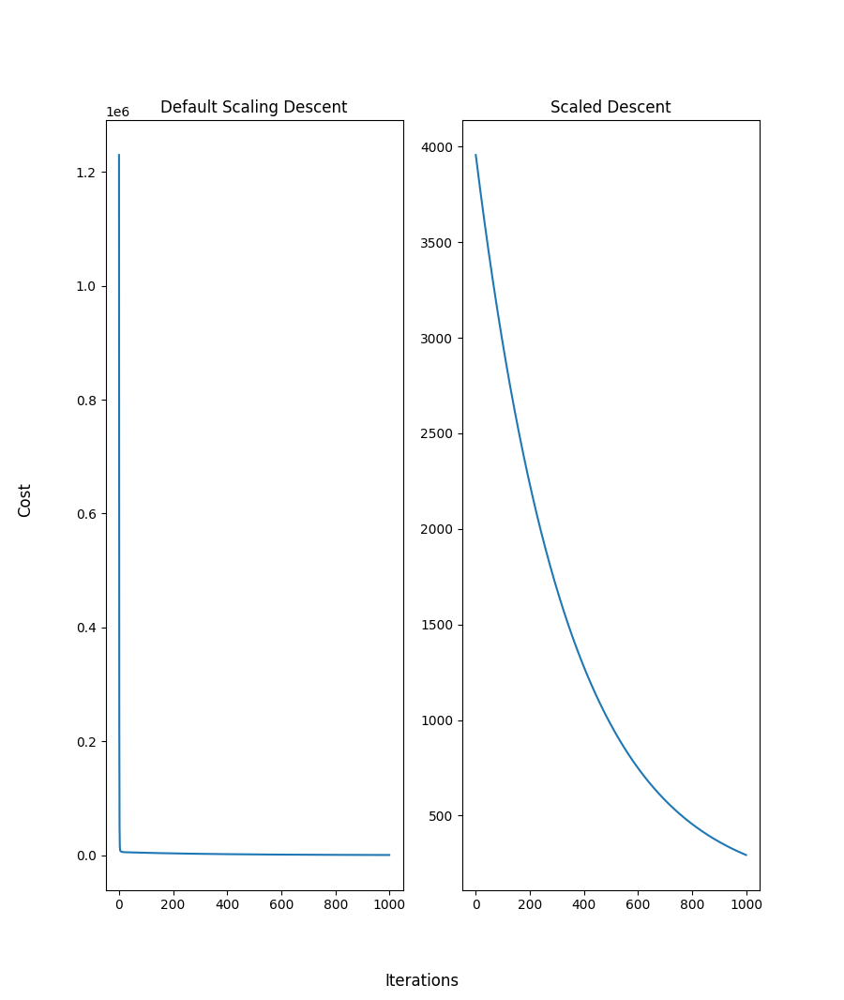

Implemented gradient descent for single & multiple feature linear regression in python

Random data set where x is house age and y is house cost (from Kaggle)

## Univariate Linear Regression
- Simply took an individual feature of the age of houses with a target of price and wrote gradient descent algorithm to optimize linear regression across the data
- cost is square error function

## Multiple Feature Linear Regression
- Implemented multiple feature gradient descent
- Compared unscaled vs scaled features to see the effect on gradient descent algorithm

